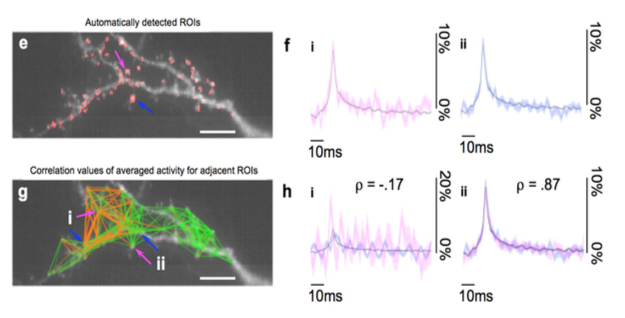

# NMF-based segmentation for Voltage Imaging Dataset

As seen in Piatkevich et al 2017 (publication link and sample data coming soon). This a computational tool for an experiment using a fluorescent voltage sensor. The input is a time-series image stack with negligible motion artifacts.

This computational method for identifying ROIs classifies pixels as either noise or signal via a rank-2 non-negative matrix factorization (NMF) on the power spectral density of each pixel trace. The signal or noise classification for all pixels is based on a human expert choosing a single example pixel that corresponds to clear Archon2 signal. Shown in red in (e) are the pixels determined to be Archon2 signal by the NMF algorithm and clustered into ROIs via connected components (ROIs of less than 6 pixels are excluded, see Online Methods for details of analysis and MATLAB code), and overlaid on a fluorescence image.

In `extractROISandTraces.m`,the raw data is loaded and segmented into regions of interest (ROI), producing the mask that is shown in figure (e) above. The spatial analysis between the different ROIs is done in `analysis_spatial.m` and produces Pearson correlation coefficients calculated between pairs of averaged fluorescence traces from each ROI, such as those shown in (g), are visualized by drawing green lines for positive correlation and orange lines for negative correlation. For temporal analysis of the traces, namely the average spike waveform shown in (f) and (h), you can use `analysis_temporal.m`

# Requirements:
[NMFTool](https://sites.google.com/site/nmftool/)

# Acknowledgments
The concept of using rank-2 NMF on the power spectral density as a segmentation method was originally by Dan Goodwin and Eftychios Pnevmatakis. The loading and saving tif routines are a modification the [CaImAn] (https://github.com/flatironinstitute/CaImAn-MATLAB) repository I/O functions. 

# For support
We want these tools to be used by the community and so it is important to us to be responsive in helping other people use these computational tools. Furthermore, this code is currently "research grade," and as such, feedback and bug reports in this repository's Issues help us improve these tools! 
